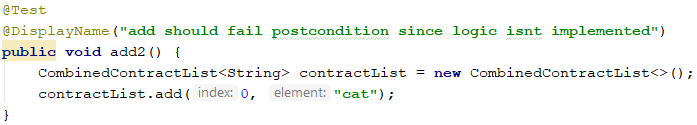
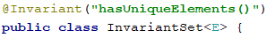
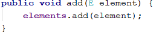
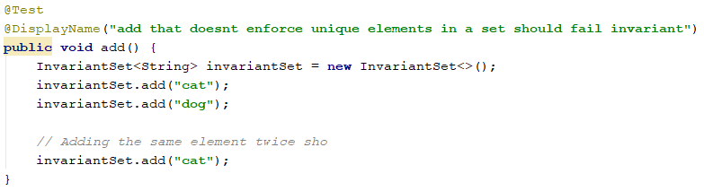
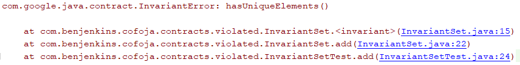

# Cofoja Examples
*A Design by Contract programming framework for Java.*

## Presentation

## What is Design by Contract?
Design by contract allows a developer to define precise specifications for software components.
These specifications, known as contracts, define preconditions, postconditions, and invariants which must be true whenever
a method is called.

### Preconditions
A precondition is a statement that must be true before a method can be run.

### Postconditions
A postcondition is a statement that is true after a method is run.

### Invariants
An invariant is a statement that is always true for an object. Invariants are run before and after each method call.

### `List.add(int index, E element)` Example
An example of  *Design by Contract* preconditions and postconditions is shown below.

It is an implementation of a `List`'s `add(int index, E element)` method using Java's assert statements.

Preconditions have been added to ensure the index is valid and that the element can be retrieved from the List
after inserting it.

 method that has precondition and postcondition assert statements")

## What is Cofoja?
Cofoja is a framework for specifying contracts in Java using annotations. 

### Defining preconditions & postconditions
Using the same example as before, we can now specify preconditons using the `@Requires` annotation
and postconditions using the `@Ensures` annotation.

 method that uses Cofojas @Requires preconditions and @Ensures postconditions")

#### Violating a precondition

If the user passes in a bad index.

The precondition will be violated and Cofoja will print the following error.

")

#### Violating a postcondition

If the user passes in correct data.

But the postcondition is violated then Cofoja will print the following error.

")

### Defining Invariants
Cofoja also allows classes to define invariants. An invariant is a statement that is true
after every method call.

An example of an invariant would be how a Set must only contain unique elements. 

To express that invariant in Cofoja, you would use the `Invariant` annotation.

The methods are written like normal.

When an Invariant is violated. 

An error is thrown.

### What benefits does Cofoja provide over Java's built in assertions?
Cofoja has two huge benefits over Java's assert statements
* Application logic is separated from contract logic.
* The contract is included in the Javadoc. 

 methods javadoc, showing the @Ensures and @Requires contracts.")

If we were using Java's built in assert methods for contracts we would have to maintain
the contract in the code and the documentation separately. Which is error prone if one 
 is updated without the other.

## What are the benefits of Design by Contract in general?
### Defect localization
When an error is raised, you know the method with the error. Which reduces debugging time.

### Determines cause of error
Contracts help determine if the implementor or user of a library caused an issue.

## What are the downsides of Design by Contract?
### Lack of native language support
[The biggest languages with native support are Clojure and Perl6.](https://en.wikipedia.org/wiki/Design_by_contract#Language_support)
 Though .NET *used to* have good support through Code Contracts.

### Cofoja license
Cofoja uses the GPLv3 license, so you most likely won't be able to use it commercially.
